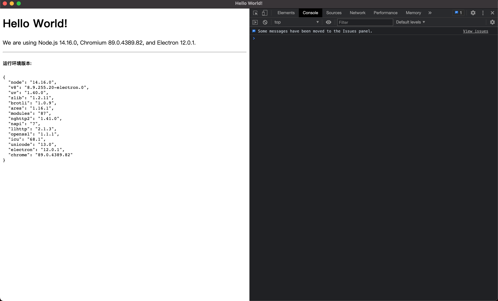

### 准备

按照[官网](https://www.electronjs.org/)描述, Electron 是基于 Nodejs 的, 首先查看是否已经安装 [NodeJs](https://nodejs.org/zh-cn/)

```bash
node -v
npm -v
```

### 基本目录

```
my-electron-app/
├── package.json
├── main.js # 主进程入口
├── preload.js
└── index.html
```

### 启动

**[main.js](https://github.com/electron/electron/blob/master/docs/tutorial/quick-start.md#create-the-main-script-file)**

```js
const { app, BrowserWindow } = require('electron');
const path = require('path');

function createWindow() {
  const win = new BrowserWindow({
    width: 800,
    height: 600,
    webPreferences: {
      preload: path.join(__dirname, 'preload.js'),
    },
  });
  win.loadFile('index.html');
}

app.whenReady().then(() => {
  createWindow();

  app.on('activate', () => {
    if (BrowserWindow.getAllWindows().length === 0) {
      createWindow();
    }
  });
});

app.on('window-all-closed', () => {
  if (process.platform !== 'darwin') {
    app.quit();
  }
});
```

**[preload.js](https://github.com/electron/electron/blob/master/docs/tutorial/quick-start.md#define-a-preload-script)**

```js
window.addEventListener('DOMContentLoaded', () => {
  const replaceText = (selector, text) => {
    const element = document.getElementById(selector);
    if (element) element.innerText = text;
  };

  for (const type of ['chrome', 'node', 'electron']) {
    replaceText(`${type}-version`, process.versions[type]);
  }
});
```

**[index.html](https://github.com/electron/electron/blob/master/docs/tutorial/quick-start.md#create-a-web-page)**

```html
<!DOCTYPE html>
<html>
  <head>
    <meta charset="UTF-8" />
    <title>Hello World!</title>
    <meta
      http-equiv="Content-Security-Policy"
      content="script-src 'self' 'unsafe-inline';"
    />
  </head>
  <body style="background: red">
    <h1>Hello World!</h1>
    <p>
      We are using Node.js <span id="node-version"></span>, Chromium
      <span id="chrome-version"></span>, and Electron
      <span id="electron-version"></span>.
    </p>
  </body>
</html>
```

### 自动刷新

- nodemon

```bash
npm i -D nodemon
```

```json
"scripts": {
  "start": "nodemon --watch * --exec electron ."
}
```

- electromon
  [github](https://github.com/simonhochrein/electromon#readme): 全局安装使用

### 调试

- [devtron](https://www.electronjs.org/devtron): 官方调试面板
- [electron-debug](https://github.com/sindresorhus/electron-debug): 封装好的

**修改 main.js**

```ts
const debug = require('electron-debug');

debug();
```

### 预览


