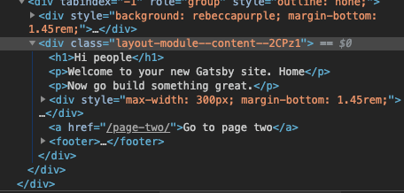

# 记录

### [部署 github](https://www.gatsbyjs.org/docs/how-gatsby-works-with-github-pages/)

```bash
npm install gh-pages --save-dev
```

- step1 添加 `package.json`

```json
"script": {
  "deploy": "gatsby build --prefix-paths && gh-pages -d public"
}
```
- step2 修改 `gatsby.config.js`

```js
pathPrefix: "your project",
```

### 添加样式

#### 全局样式
- step1: 创建全局样式文件 `global.css` 位于 `src`下或根目录下
> global.css
```css
html {
  background-color: lavenderblush;
}
```

- step2: 创建 `gatsby-browser.js` 具体参看[gatsby browser apis](https://www.gatsbyjs.org/docs/browser-apis/)
> gatsby.browser.js
```js
import './global.css';

// or 
// require('./global.css');
```

#### 重置样式
- [normalize.css/](https://necolas.github.io/normalize.css/)

#### 使用 css module

- step1: 创建 `layout.module.css`, 对于命名使用 `module.css`为后缀,表明是使用模块引入
> layout.js
```js
import styles from './layout.module.css';

export default function Layout() {
  return (
    <div className={styles.content}>
      content
    </div>
  );
}
```
- step2: 查看




### 使用 css in js

> - 参考链接
>   - [all-you-need-to-know-about-css-in-js](https://hackernoon.com/all-you-need-to-know-about-css-in-js-984a72d48ebc)

- [typography](https://kyleamathews.github.io/typography.js/)

#### 使用 glamor
- [glamor](https://github.com/threepointone/glamor)

```bash
# 安装
npm install --save gatsby-plugin-glamor glamor
```
> 配置 gatsby-config.js
```js
plugins: [`gatsby-plugin-glamor`],
```
> 参见 `src/components/header.js`

#### 使用 styled-component

- [styled-component](https://www.styled-components.com/)

```bash
# 安装
npm install --save gatsby-plugin-styled-components styled-components babel-plugin-styled-components
```

> 配置 gatsby-config.js

```js
plugins: [`gatsby-plugin-styled-components`],
```
> 参见 `src/component/footer.js`

#### sass

```bash
# 安装
npm install --save node-sass gatsby-plugin-sass
```
> 配置 gatsby-config.js

```js
plugins: [`gatsby-plugin-sass`],
plugins: [
  {
    resolve: `gatsby-plugin-sass`,
    options: {
      implementation: require("sass"),
    },
  },
]
```

#### 更多 
> 参见 [更多](https://www.gatsbyjs.org/tutorial/part-two/)

### 使用 graphql

- [howtographql](https://www.howtographql.com/)