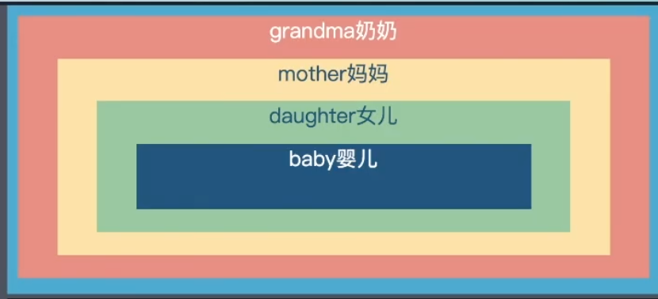

## 事件

### 描述

事件是指: Javascript 通过添加处理程序(监听) 和 HTML 进行交互

**注册事件**: 分为两种并且接收一个事件对象 [Event](https://developer.mozilla.org/en-US/docs/Web/API/Event)包含一些与事件有关的内容, 比如常用的

- target: 总是指向当前触发事件的元素
- currentTarget: 总是指向注册事件监听器的元素

**注册方式**: 每一个 DOM 元素都可以通过 `on` 和 `addEventListener`

- `on` + `eventName`
- `addEventListener(eventName, handler, options)`

```html
<body>
  <div class="outer">
    <div class="inner">inner</div>
  </div>
  <script type="module">
    // 先选择需要注册事件的节点
    const container = document.querySelector('.outer');

    container.addEventListener('click', (evt) => {
      console.log(evt.target, evt.currentTarget);
    });

    container.onclick = (evt) => {
      console.log(evt.target, evt.currentTarget);
    };
  </script>
</body>
```

### 事件流

事件流描述的是从页面接收事件的顺序, 分为两种: **事件冒泡** 和 **事件捕获**

- 事件冒泡: 从当前触发事件的元素向上传递父级, `body` `html` `document`直到 `window` 对象
- 事件捕获: 从嘴歪的节点 `document` 向下寻找触发事件的目标

简单的说: 事件冒泡就是从内到外, 而 事件捕获就是从外到内, 且分为三个阶段

- 捕获阶段: 事件从 `window` 走近事件目标元素
- 处于当前目标阶段: 达到事件目标元素
- 冒泡: 从事件元素开始向上冒泡

[](https://www.w3.org/TR/DOM-Level-3-Events/#event-flow)

`addEventListener` 除了接收 事件名称 (`eventName`)和处理函数(`handler`) 之外还可以接收一个可选参数 `capture`(事件处理的方式)

- `true`: 在捕获阶段处理程序 从外到内
- `false`: 在冒泡阶段处理程序, 默认为 `false` 从内到外
  复制以下代码放到 `html` 中, 通过修改第三个参数 `capture` 查看控制台

```typescript
const constainer = document.getElementById('container');

document.addEventListener(
  'click',
  () => {
    console.log('>>>>>>>>>>1');
  },
  false,
);

document.body.addEventListener(
  'click',
  () => {
    console.log('>>>>>>>>>>>2');
  },
  false,
);

constainer.addEventListener(
  'click',
  () => {
    console.log('>>>>>>>>>>>3');
  },
  false,
);
```

**通过 addEventListener 方法注册的监听事件 可以通过 removeEventListener 移除, 且需要和同一元素注册时的阶段一致, 同一元素可以注册多个事件监听, 并同一阶段处理函数会按照注册顺序执行**

**示例题: 在以下结构分别添加事件, 执行结果是什么 ?**

**[完整代码](https://github.com/niexiaofei1988/hello-interview/tree/main/resoure/event.html)**



```typescript
function sayName() {
  console.log(`我是: ${this.className}`);
}

baby.addEventListener('click', sayName, false);
daughter.addEventListener('click', sayName, true);
mother.addEventListener('click', sayName, true);
grandma.onclick = sayName;
```

### 兼容 IE

在 IE9 之前仅仅支持事件冒泡,并且注册监听事件方式也不同, 为了更好的能够在 IE 中同一使用, 需要兼容在 IE 下的事件注册, 注册([attachEvent](http://help.dottoro.com/ljinxrmt.php)) 取消事件监听([detachEvent](http://help.dottoro.com/ljfjejhf.php)), 如果要设置事件处理阶段可以使用 [setCapture](https://developer.mozilla.org/en-US/docs/Web/API/Element/setCapture)

```typescript
const EventUtil = (() => {
  return {
    addEventHandler(el, eventName, handler) {
      if (el.addEventListener) {
        el.addEventListener(eventName, handler, false);
      } else {
        el.attachEvent(eventName, handler);
      }
    },
    removeEventHandler(el, eventName, handler) {
      if (el.removeEventListener) {
        el.removeEventListener(eventName, handler, false);
      } else {
        el.detachEvent(eventName, handler);
      }
    },
  };
})();
```

### this

这是一个最让人头疼的事, 注册的事件中 经常会使用到 `this` 总是指向`window`, 而通过 `HTML`方式添加事件时总是指向当前触发事件的元素

```html
<div onclick="console.log(this)">总是指向当前元素</div>
```

`on` 和 `addEventListener`

```typescript
// 使用之前 inner outer 例子
const container = document.querySelector('.outer');
container.addEventListener('click', () => {
  console.log(this); // window
});
```

**严格模式下 this 指向 undefined**

### 事件对象

**列举常用的属性**

- `target`: 当前触发事件的元素
- `currentTarget`: 当前注册事件的元素
- `preventDefault`: 阻止默认行为, 例如 `a`标签链接, [在编辑域中阻止按键](https://developer.mozilla.org/zh-CN/docs/Web/API/Event/preventDefault#stopping_keystrokes_from_reaching_an_edit_field): 可以阻止某些键输入
- `stopPropagation`: 阻止冒泡或捕获行为的进一步传波
- `stopImmediatePropagation`: 同样是可以阻止行为进一步传播 和 `stopPropagation` 不同的是, 可以阻止在调用此函数的注册事件之后的注册程序, 听起来有点绕

`.outer > .inner`

```typescript
inner.addEventListener('click', (evt) => {
  console.log('内层执行 inner');
});

outer.addEventListener('click', (evt) => {
  console.log('外层执行 outer');
  evt.stopImmediatePropagation(); // 阻止向上传播
});

document.body.addEventListener('click', (evt) => {
  console.log('此后的事件无法接受到');
});
```

### 事件委托

事件委托也称为事件代理, 简单的说就是通过父级或者祖先元素注册监听事件, 网上有很多种例子, 比较好理解的就是收快递的事. 那就也用这个例子, 在公司上班的同事经常会在网上购买一些物品
通过快递公司发送到公司然后再派送到购买人, 当快递小哥把物品送到公司时, 可能接收人(子元素)不在公司或者比较忙 无法签收, 此时就可以让前台小妹妹(父级或祖先注册)代签甚至有些时候还需要代付.
对于新进的同事同样可以通过这种方式接受快递

在此之前 `ul` 下有 `10`个 `li`子元素, 绑定事件时需要通过循环方式

```typescript
const list = document.querySelectorAll('li');

for (let ele of list) {
  ele.addEventListener('click', (evt) => {
    console.log(evt.target);
  });
}
```

使用这种方式的缺点

- 每一个元素都添加注册监听事件均需要创建一个处理程序(handler), 大量的创建函数时势必会造成一定性能的损耗
- 无法对动态增加的子元素添加事件监听

正是因为如此, 将注册事件代理到父级元素上

```typescript
const ul = document.querySelector('ul');
ul.addEventListener('click', (evt) => {
  if (evt.target && evt.target.nodeName.toLowerCase() === 'li') {
    console.log('点击了 li 元素');
  }
});
```

**优点**

- 注册一个事件监听大量子元素, 提高性能
- 动态添加子元素在事件代理的注册元素范围内都可以触发事件

虽然性能可提高, 动态绑定, 但相比较一些极其消耗性能的事件类型时, 无法使用

**局限性**

- 对于一些不包含事件冒泡机制的类型无法进行代理, 比如: `focus`
- 性能消耗严重的事件, 比如 `mousemove`

### 其他更多事件

- **[MDN Events](https://developer.mozilla.org/zh-CN/docs/Web/Events)**
- **[事件参考手册](https://www.w3school.com.cn/jsref/jsref_events.asp)**

### 参考

- [事件委托](https://zh.javascript.info/event-delegation)
- [事件的传播和事件冒泡以及事件委托](https://zhuanlan.zhihu.com/p/355295675)
- [What is DOM Event delegation?](https://stackoverflow.com/questions/1687296/what-is-dom-event-delegation)
- [How JavaScript Event Delegation Works](https://davidwalsh.name/event-delegate)
- [A Simple Explanation of Event Delegation in JavaScript](https://dmitripavlutin.com/javascript-event-delegation/)
- [JavaScript 事件委托详解](https://zhuanlan.zhihu.com/p/26536815)
- [彻底弄懂 JS 事件委托的概念](https://www.cnblogs.com/soyxiaobi/p/9498357.html)
- [JavaScript 事件委托原理](https://segmentfault.com/a/1190000012313105)
- [MDN Element.matches](https://developer.mozilla.org/zh-CN/docs/Web/API/Element/matches)

**_废了么 ? 别急 才冰山之一角_**

---

## 自定义事件

- [创建和触发 events](https://developer.mozilla.org/zh-CN/docs/Web/Guide/Events/Creating_and_triggering_events)
- [创建自定义事件](https://zh.javascript.info/dispatch-events)

---
