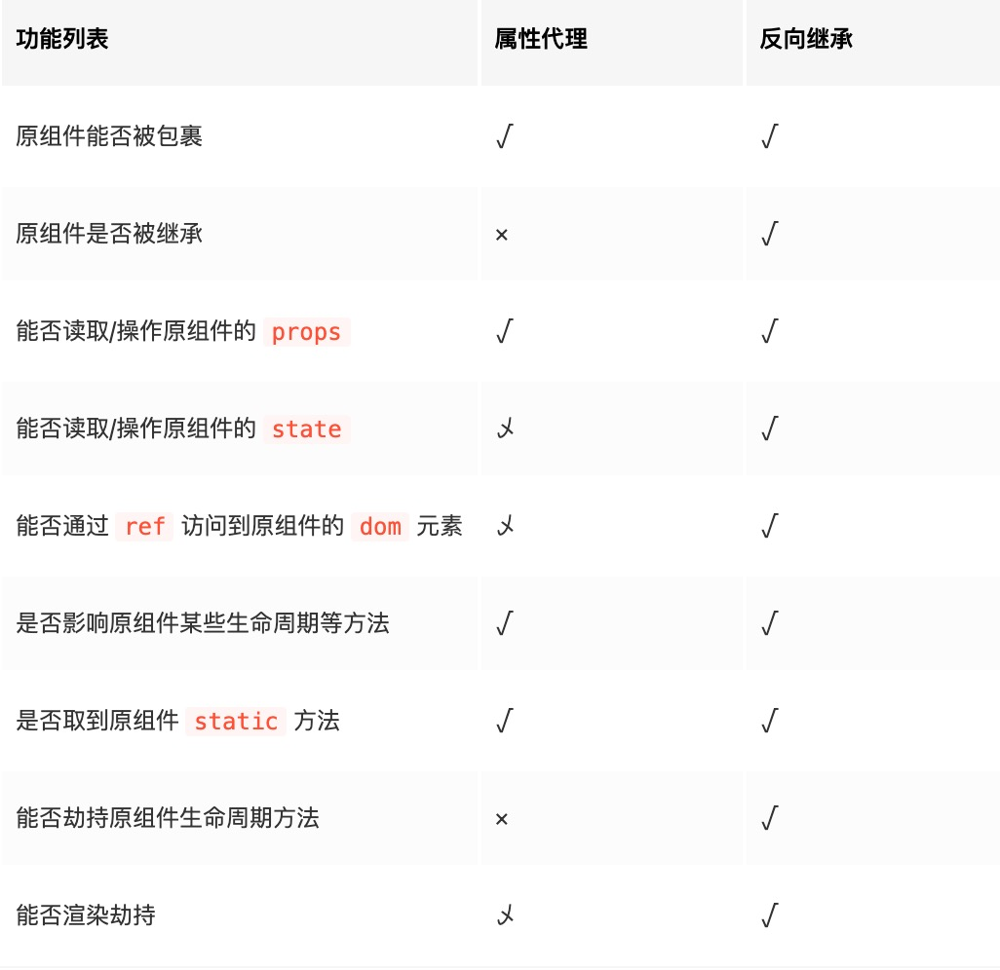

# What ?

高阶组件(HOC) 是 React 中 用于复用组件逻辑的一种技巧, 自身不是 React API 的一部分, 而是一种用于 React 的组合特性而形成的设计模式,

- 对于普通的组件是将 Props 中的数据转换为 UI
- 高阶组件不是组件, 接受一个 React 组件返回一个增强的 React 组件(比如: 改造汽车), 不是组件而是函数(比如高阶函数 map, reduce)

```ts
const EnhancedComponent = higherOrderComponent(WrappedComponent);
```

<!--truncate-->

# Why ?

业务开发中, 大量出现相似度极高的组件或页面, 频繁的开发多余无效代码, 降低开发效率, 使用高阶组件可以解决类似组件频繁开发

- 抽取重复逻辑: 代码复用, 页面复用
- 条件判断(渲染劫持): 权限控制
- 捕获生命周期: 日志打点, 埋点上报, 错误捕获等

# 实现高阶组件的方式 ?

实现高阶组件分为两种方式:

- 属性代理(props proxy): 高阶组件通过被包裹的 `React` 组件来操作 `props`, 简单的说就是传入一个 `React` 组件经过针对组件做的一系列增强, 最终通过 `render` 重新返回一个新的组件
- 反向继承(inheritance inversion): 高阶组件继承自被包裹的 `React` 组件

## 属性代理

属性代理是最常见的实现方式, 本质上是使用组合的方式(即: 针对包裹的 React 组件做一些增强的属性) 可以理解为外部注入一些方法或者属性, 最终将增强的组件进行返回(在组件内部就可以使用注入的一些方法)(拼装流水线),
通过属性代理实现的高阶朱就爱能和原来的组件属于一个类似流水线的工作一样,从入口进入初始的组件 (经过多次增强后)形成最终的成品, 这也使得调用原始组件的生命周期时的顺序会有一些变化, 例如

属性代理的方式 大多也可以使用 [render Props](https://zh-hans.reactjs.org/docs/render-props.html)代替

import LifeCycleDemo from '@site/src/components/demos/LifeCycleDemo';

<LifeCycleDemo />

### 1. 操作 Props

可以对传入的 `props` 进行读取 修改, 添加新属性以及删除某些属性, 需要注意的是: 不应该和传入的 `props` 属性名有冲突

import PropsDemo from '@site/src/components/demos/PropDemo';

<PropsDemo />

### 2. 抽象 state

将包裹组件中的状态提到包裹组件中 来实现一个受控组件(自动注入双向绑定, 同样也可以使用 renderProps `() => <input />`)

import StateDemo from '@site/src/components/demos/StateDemo';

<StateDemo />

### 3. 包裹其他元素

比如一些样式布局通过外层添加外层容器实现布局

import { LayoutDemo } from '@site/src/components/demos/LayoutDemo';

<LayoutDemo />

### 4. 获取 ref 引用

#### 函数组件

普通的函数组件是无法通过 ref 获取到组件本身及组件内部的方法的

import FunctionRefDemo from '@site/src/components/demos/FunctionRefDemo';

<FunctionRefDemo />

#### class 组件

通过 `ref` 获取到组件实例, 调用组件实例方法

import ClassRefDemo from '@site/src/components/demos/ClassRefDemo';

<ClassRefDemo />

### 5.条件渲染

import { ConditionalProxy } from '@site/src/components/demos/ConditionalDemo';

<ConditionalProxy />

## 反向继承

在定义常规`JS`中 `class`, [实例化 class 中的 static 会被继承吗 ?](https://developer.mozilla.org/zh-CN/docs/Web/JavaScript/Reference/Classes/static)

```ts
class A {
  constructor(width, height) {
    this.width = width;
    this.height = height;
  }
  static getDesc() {
    return 'This is A';
  }
}

class B extends A {
  constructor(width, height) {
    super(width, height);
  }
}

const b = new B(100, 10);
```

### 包裹其他元素(组合渲染)

import { ReverseLayout } from '@site/src/components/demos/LayoutDemo';

<ReverseLayout />

### 条件渲染

多用于权限控制, 登录判断等

import { ReverseConditional } from '@site/src/components/demos/ConditionalDemo';

<ReverseConditional />

## 对比



---

## 自定义 hooks

hooks 只能在函数组件中使用, 解决了原本函数组件只能作为无状态组件渲染

自定义实现伪双向绑定

import BindInput from '@site/src/components/demos/BindInput';

<BindInput />

- [DEMO](https://codesandbox.io/s/learn-hooks-0fosd): 大多是官方示例演示
- [codepen](https://codepen.io/niexiaofei/pen/GeWeXZ)
- [自定义 Hooks 测试](https://codesandbox.io/s/zidingyihooks-ceshi-c6wb2)
- [预览测试](https://bricksjs-hooks.surge.sh/#/./use-detail?anchor=%E5%9F%BA%E6%9C%AC%E7%94%A8%E6%B3%95)
- [useDetail](https://github.com/bricksjs/hooks/blob/dev/src/useDetail/index.ts)

## 注意事项

[官方文档](https://zh-hans.reactjs.org/docs/higher-order-components.html#caveats)

- 在类组件中如果包含了 `static` 方法, 需要进行拷贝, 否则将不会传递 [查看](https://zh-hans.reactjs.org/docs/higher-order-components.html#static-methods-must-be-copied-over), 可以使用 [hoist-non-react-statics](https://github.com/mridgway/hoist-non-react-statics)自动拷贝
- Refs 不会被传递: 直接将 ref 绑定在 WrappedComponent 组件上, 实际上只能获取到 WrappedComponent(如果是类组件的话)实例,而不能获取到原组件内的 ref 绑定, [参考 class 组件获取 Ref](#class-组件)
- 不应在 `render` 中调用高阶组件, 每次返回的组件是不相同的, 导致每次都会进行新的生命周期循环
- 复制 displayName, 如果使用了 react-devtool 调试工具的话

## 缺点

- 大量使用 HOC, 调用困难, 注入数据难以排查具体来源
- 多个高阶组件混合使用时, 可能会出现变量名冲突问题

## 参考链接

- [【React深入】从Mixin到HOC再到Hook](https://juejin.cn/post/6844903815762673671)
- [React高阶组件(HOC)的入门📖及实践](https://juejin.cn/post/6844904050236850184)
- [React 高阶组件(HOC)入门指南](https://juejin.cn/post/6844903477798256647)
- [Render Props](https://react.docschina.org/docs/render-props.html): 官方文档
- [React Hooks 之于 HoC 与 Render Props](https://zhuanlan.zhihu.com/p/62791765)
- [React Hooks 最佳实践](https://react.docschina.org/blog/2020/05/22/react-hooks.html)
- [React Higher Order Components in 3 minutes](https://codeburst.io/higher-order-components-in-3-minutes-93173b2ebe52): [【译】三分钟掌握 React 高阶组件](https://segmentfault.com/a/1190000019153177)
- [带着三个问题深入浅出React高阶组件](https://juejin.cn/post/6844903491425533959)
<!-- - [深入React 技术栈](https://github.com/jiandanaiyici/frontend-resource/blob/master/React/%E6%B7%B1%E5%85%A5REACT%E6%8A%80%E6%9C%AF%E6%A0%88%20.pdf): 81 ~ 97页 -->
- [Do Hooks replace render props and higher-order components](https://reactjs.org/docs/hooks-faq.html#do-hooks-replace-render-props-and-higher-order-components)
- [装饰器](https://es6.ruanyifeng.com/#docs/decorator)
- [Awesome React Hooks: React Hooks 相关清单](https://github.com/glauberfc/awesome-react-hooks#readme)

<!--
- [Proxy](https://es6.ruanyifeng.com/#docs/proxy)
- [React 常见的 15 个问题](https://zhuanlan.zhihu.com/p/56663053)
https://zhuanlan.zhihu.com/p/85969406
https://juejin.cn/post/6844903477798256647
https://github.com/MrErHu/React-Advanced-Guides-CN
https://zxuqian.cn/docs/videos/react/react-props-button

-->

<!--truncate-->
